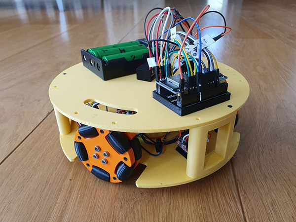

# Another Three-wheeled omnidirectional Robot

### twr-esp32 
Contains the platformio project for the ESP32 source. Tested and working for a esp32 wroom board
The program receives bluetooth commands to test and drive the robot

### twr_app_flutter
Contains a Flutter app to test and drive the robot via bluetooth. Tested and working on Andorid

### twr-app-angular
Contains an Angular web-app to test and drive the robot via bluetooth
